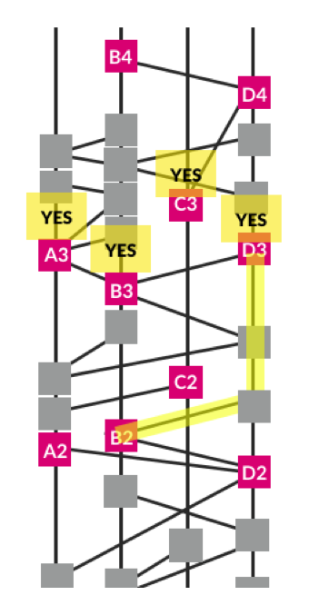

# Swirlds Hashgraph Consensus Algorithm
### Fair, Fast, Byzantine Fault Tolerance

- Introduction
- Core concepts
- Gossip about gossip: the hashgraph
- Consensus algorithm
- Proof of Byzantine fault tolerance
- Fairness
- Generalizations and enhancements
- Conclusions
